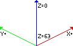

## libvxl

* read n' write Ace of Spades map files **easily** and **fast**
* compressed internal format derived from .vxl
* supports enhanced features for special cases:
  * floating block detection
  * get top layer block, useful for map overviews

All functions use voxlap's coordinate system:



## Example

```C
//create map from v pointer
struct libvxl_map m;
libvxl_create(&m,512,512,64,v);

//get color at position (x,y,z)
int col = libvxl_map_get(&m,x,y,z);

//check if block is solid at (x,y,z)
int solid = libvxl_map_issolid(&m,x,y,z);

//free map after use
libvxl_free(&m);
```

## API functions

```C
//Load a map from memory or create an empty one
void libvxl_create(struct libvxl_map* map, int w, int h, int d, const void* data);
//Write a map to disk, uses libvxl_write() internally
void libvxl_writefile(struct libvxl_map* map, char* name);
//Compress the map back to vxl format and save it in out, the total byte size will be written to size
void libvxl_write(struct libvxl_map* map, void* out, int* size);
//Tells if a block is solid at location [x,y,z]
int libvxl_map_issolid(struct libvxl_map* map, int x, int y, int z);
//Tells if a block is visible on the surface, meaning it is exposed to air
int libvxl_map_onsurface(struct libvxl_map* map, int x, int y, int z);
//Read block color
int libvxl_map_get(struct libvxl_map* map, int x, int y, int z);
//Read color of topmost block (as seen from above at Z=0)
void libvxl_map_gettop(struct libvxl_map* map, int x, int y, int* result);
//Set block at location [x,y,z] to a new color
void libvxl_map_set(struct libvxl_map* map, int x, int y, int z, int color);
//Set location [x,y,z] to air, will destroy any block at this position
void libvxl_map_setair(struct libvxl_map* map, int x, int y, int z);
//Free a map from memory
void libvxl_free(struct libvxl_map* map);
```
